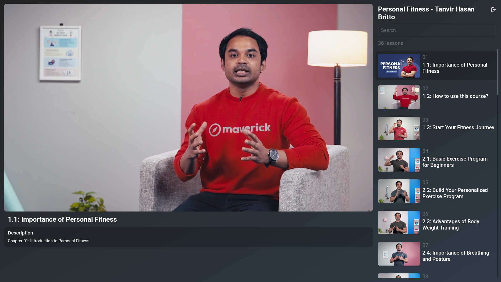

# LinkTube

> A distraction-free YouTube playlist viewer — no recommendations, no algorithm, just your content.

## ✨ Features

- **Clean Interface** - Focus on your playlist without sidebar distractions
- **Resume Playback** - Continue exactly where you left off
- **Multiple Playlists** - Switch between saved playlists seamlessly
- **PWA Support** - Install as a native app on any device
- **Fully Responsive** - Optimized for desktop, tablet, and mobile
- **Privacy-Focused** - No tracking or data collection
- **API Key Support** - Optionally use your own YouTube API key

## 🌐 Explore

**Website**
1. Go to [linktube.vercel.app](https://linktube.vercel.app/)
2. Paste a YouTube playlist URL or ID
3. Start watching

**Install as App (PWA)**
- **Desktop:** Click the install icon in your browser’s address bar  
- **Mobile:** Use “Add to Home Screen” from your browser menu

## 🧩 Extension

Enhance your YouTube player with **LinkTube** extension — available for:

- **[Chrome](https://github.com/ZeroMB/drive/releases/download/extensions/LinkTube.v1.0.0.crx)**
- **[Firefox](https://addons.mozilla.org/addon/custom-embedded-youtube-video/)**

**Features:**
- Adjust player controls  
- Remove unwanted elements  
- Match LinkTube’s clean style

---

This project is licensed under the MIT License — see the [LICENSE](LICENSE) file for details.

---

⭐ **Star this repo** if you find it helpful!
